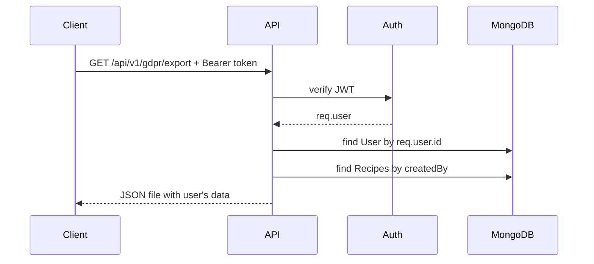

# Workshop vecka 9: GDPR i RecipeRiot backend

Målet är att du steg för steg ska kunna bygga GDPR-stöd i backend utan att bara kopiera blint. Vi fokuserar på det som passar ert projekt just nu:

- säker och strukturerad loggning med `pino`, `pino-http` och `pino-pretty`
- vad vi ska redigera bort med `redact`
- skillnaden mellan vanlig app-logger och HTTP-logger
- dataexport för inloggad användare
- soft delete och hard delete
- dataminimering, retention och dokumentation

Du är på helt rätt spår när du reagerar på att projektet använder TypeScript och ESM. Det påverkar hur vi importerar paket och hur lokala filer importeras.

## Nuläge i projektet

Det här är redan gjort:

- `backend/src/config/baseLogger.ts` finns och använder `pino`.
- `backend/src/middleware/logger.ts` finns och använder `pino-http`.
- `logger.ts` importerar grundloggern från `../config/baseLogger.js`.
- `pino-http` importeras med namngiven import: `import { pinoHttp } from 'pino-http';`.
- `npm run build` har fungerat efter uppdelningen.

Det här återstår eller behöver kontrolleras:

- `backend/package.json` behöver få `pino`, `pino-http` och `pino-pretty` som dependencies/devDependencies.
- `app.ts` använder fortfarande både `morgan('dev')` och `logger`, vilket betyder dubbel HTTP-loggning.
- `redact` fungerar redan för lösenord, token, cookie och authorization, men kan senare utökas för `email`, `username` och `identifier`.

Bra att du styrde mot att följa studiematerialet. Vi har nu samma grundidé som materialet, men översatt till TypeScript och ESM.

## Steg 1: Förstå GDPR-målet

Ledande frågor:

- Vilken data i RecipeRiot kan kopplas till en person?
- Är `email` en personuppgift?
- Är `username` en personuppgift?
- Är `createdBy` i ett recept en personuppgift?
- Ska `passwordHash` någonsin skickas till klienten eller loggas?

Bra tanke: i ert projekt är minst detta personuppgifter eller säkerhetskänsligt:

- `User.email`
- `User.username`
- `User.passwordHash`
- `User.role`
- `User.createdAt` och `updatedAt`
- `Recipe.createdBy`
- recept som går att koppla till en användare
- JWT-token i `Authorization`-headern

Varför är detta viktigt?

GDPR handlar inte bara om att kunna radera ett konto. Det handlar också om dataminimering, rätt till tillgång, rätt till dataportabilitet, rätt till radering och att inte skapa nya läckor i loggarna.

Vad skulle hända annars?

Om vi loggar hela request bodies eller returnerar hela Mongoose-dokument kan vi råka läcka `passwordHash`, tokens, email eller annan personlig data.

## Steg 2: Installera rätt paket

I `backend` behövs detta i projektets backend-paket:

```bash
npm install pino pino-http
npm install -D pino-pretty
```

Nuläge: koden använder redan dessa paket, men `backend/package.json` visar dem inte ännu. Därför behöver installationen göras i `backend` så att projektet fungerar på en annan dator också.

Varför `pino-pretty` som dev dependency?

`pino` skriver JSON-loggar. Det är perfekt för produktion, men jobbigt att läsa i terminalen när vi utvecklar. `pino-pretty` gör loggarna mer läsbara lokalt. I produktion vill vi oftast behålla ren JSON så loggarna kan skickas till exempel Datadog, ELK eller molnloggning.

Behövs `@types/pino` eller `@types/pino-http`?

Oftast nej. Moderna versioner av `pino` och `pino-http` har egna TypeScript-typer. Börja därför med paketen ovan och kör sedan:

```bash
npm run build
```

Om TypeScript först då säger att typer saknas kan man undersöka `@types/...`, men installera inte extra typer i onödan.

## Steg 3: Skillnaden mellan `pino` och `pino-http`

Ledande fråga:

- När vill vi logga en egen händelse, och när vill vi automatiskt logga varje HTTP-request?

`pino` är den vanliga loggern.

Den används när du själv vill logga en händelse i koden:

```ts
logger.info(
  { event: 'server.started', port: 3000 },
  'Server started'
);
```

`pino-http` är Express-middleware.

Den används för att automatiskt logga inkommande requests och responses:

```ts
app.use(logger);
```

Den ger också `req.log`, så controllers senare kan skriva loggar som hör ihop med samma request.

Varför är detta viktigt?

Om vi bara använder `pino` måste vi själva komma ihåg att logga varje request. Om vi bara använder `pino-http` saknar vi en tydlig app-logger för saker som databasanslutning, serverstart eller schemalagda jobb.

Bra struktur i ert projekt:

- `backend/src/config/baseLogger.ts`: vanlig Pino-logger
- `backend/src/middleware/logger.ts`: HTTP-middleware med `pino-http`

## Steg 4: ESM och TypeScript-regler i projektet

Ert projekt har:

```json
{
  "type": "module"
}
```

och i `tsconfig.json`:

```json
{
  "module": "NodeNext",
  "moduleResolution": "NodeNext",
  "esModuleInterop": true
}
```

Det betyder:

- paket från `node_modules` importeras utan `.js`
- lokala filer i projektet importeras med `.js`
- Node built-ins kan importeras med `node:`-prefix

Exempel:

```ts
import pino from 'pino';
import { pinoHttp } from 'pino-http';
import crypto from 'node:crypto';
import logger from '../config/baseLogger.js';
```

Varför `.js` på lokala imports?

TypeScript kompilerar `.ts` till `.js`. När Node kör den färdiga filen i `dist` letar den efter `.js`, inte `.ts`. Därför skriver vi `.js` redan i TypeScript-koden när vi använder `NodeNext`.

## Steg 5: Base logger med `pino`

Det här är ungefär vad ni har just nu i `backend/src/config/baseLogger.ts`:

```ts
import pino from 'pino';

const logger = pino({
  level: process.env.LOG_LEVEL || 'info',
  transport: process.env.NODE_ENV !== 'production'
    ? { target: 'pino-pretty' }
    : undefined,
  redact: {
    paths: [
      'req.headers.authorization',
      'req.headers.cookie',
      'req.body.password',
      'req.body.passwordHash',
      'req.body.token',
      '*.password',
      '*.passwordHash',
      '*.token',
    ],
    censor: '[REDACTED]',
  },
});

export default logger;
```

Detta ligger nära studiematerialets CommonJS-exempel, men med ESM/TypeScript:

- materialet använder `const pino = require('pino')`
- vi använder `import pino from 'pino'`
- materialet använder `module.exports = logger`
- vi använder `export default logger`

Varför ska `redact` vara så bred?

För att loggar är ett vanligt ställe där känslig data råkar hamna. Just nu skyddar ni det viktigaste från studiematerialet: `authorization`, `cookie`, `password`, `passwordHash` och `token`.

Nästa förbättring kan vara att utöka `redact` för RecipeRiot:

```ts
'req.body.identifier',
'req.body.email',
'req.body.username',
'*.email',
'*.identifier',
'*.username',
```

Varför kan det vara bra?

`identifier` används vid login, och kan vara email eller username. Både email och username kan vara personuppgifter.

Viktigt att förstå:

`redact` ersätter matchande fält med `[REDACTED]`. Det betyder inte att vi ska logga allt och lita blint på redact. Det är ett skyddsnät, inte en ursäkt för att logga hela `req.body`.

Bra du behöver öva på:

Fråga alltid: "Om den här loggen läcker, kan någon använda den för att identifiera eller kapa en användare?"

## Steg 6: HTTP logger med `pino-http`

Det här är vad ni har just nu i `backend/src/middleware/logger.ts`:

```ts
import crypto from 'node:crypto';
import { pinoHttp } from 'pino-http';
import logger from '../config/baseLogger.js';

const httpLogger = pinoHttp({
  logger,
  customSuccessMessage: (req, res) => {
    return `${req.method} ${req.url} ${res.statusCode}`;
  },
  customErrorMessage: (req, res, err) => {
    return `${req.method} ${req.url} ${res.statusCode} failed: ${err.message}`;
  },
  genReqId: (req) => {
    const requestId = req.headers['x-request-id'];

    if (typeof requestId === 'string') {
      return requestId;
    }

    return crypto.randomUUID();
  },
  customLogLevel: (_req, res, err) => {
    if (err || res.statusCode >= 500) {
      return 'error';
    }

    if (res.statusCode >= 400) {
      return 'warn';
    }

    return 'info';
  },
});

export default httpLogger;
```

Varför `genReqId`?

Varje request får ett id. Om en request skapar flera loggrader kan man söka på samma request-id och följa hela flödet. Det kallas ofta correlation id.

Varför `customLogLevel`?

Alla responses är inte lika allvarliga:

- `2xx` och `3xx`: normal trafik, `info`
- `4xx`: klientfel, ofta `warn`
- `5xx`: serverfel, `error`

Vad skulle hända annars?

Om allt loggas som `info` blir det svårare att hitta riktiga fel. Om allt loggas som `error` blir loggarna för brusiga och larm kan börja gå i onödan.

Hur stämmer detta med studiematerialet?

Studiematerialet visar `customSuccessMessage` och `customErrorMessage`, och de finns nu med i er `logger.ts`. Ni har dessutom `customLogLevel`, som styr vilken nivå loggen får:

- lyckade requests blir `info`
- klientfel blir `warn`
- serverfel blir `error`

Det betyder att ni ligger nära materialet, men har en extra förbättring: loggarna får olika nivå beroende på statuskod.

## Steg 7: Behövs fallback för ESM/CommonJS?

Ibland ser man denna lösning:

```ts
import pinoHttpModule from 'pino-http';

const pinoHttp =
  typeof pinoHttpModule === 'function'
    ? pinoHttpModule
    : pinoHttpModule.default;
```

Vad händer här?

Koden testar om importen blev själva funktionen direkt. Om ja används den. Annars antar den att importen blev ett objekt där funktionen ligger på `.default`.

Behövs den i ert projekt?

Börja utan fallback, men använd den namngivna exporten:

```ts
import { pinoHttp } from 'pino-http';
```

I ert projekt visade `npm run build` att default-importen inte blev callable. Paketets typer exporterar däremot `pinoHttp` som namngiven export, så detta är den renaste lösningen. Lägg bara till fallback om både default-import och namngiven import skulle ge problem vid runtime.

Varför är detta viktigt?

Det är bättre att börja med enkel kod som TypeScript förstår. Fallback-lösningen är bra att känna till, men den gör koden svårare att läsa för nybörjare.

## Steg 8: Ta bort dubbel HTTP-loggning

Nuläge: `app.ts` använder fortfarande både:

```ts
app.use(morgan('dev'));
app.use(logger);
```

När ni byter till `pino-http` bör ni välja en HTTP-logger. Rekommendationen är att ta bort `morgan` och behålla `pino-http`.

Varför?

Annars loggas varje request två gånger. Det blir mer brus och gör det svårare att följa loggarna.

Finns det fler bra lösningar?

Ja. Under en övergång kan man ha kvar `morgan` lokalt, men i ett projekt där vecka 9 handlar om strukturerad loggning är det bättre att låta `pino-http` ta över.

## Steg 9: Säker loggning i controllers

Ledande frågor:

- Ska vi logga användarens email vid login?
- Ska vi logga JWT-token?
- Ska vi logga hela `req.body`?
- Vad räcker för felsökning?

Bra logg:

```ts
req.log.info(
  { event: 'auth.login.success', userId: user._id.toString() },
  'User logged in'
);
```

Dålig logg:

```ts
req.log.info({ body: req.body }, 'Login request');
```

Varför är den dålig?

`req.body` kan innehålla `password`, `email`, `identifier` eller andra personuppgifter. Även om `redact` skyddar vissa fält ska du inte göra loggen större än nödvändigt.

Bra princip:

Logga händelsen, intern id-referens och teknisk status. Undvik direkta personuppgifter.

## Steg 10: Soft delete på `User`

Ledande frågor:

- Vad är skillnaden mellan soft delete och hard delete?
- Varför kan soft delete vara ett mellansteg?
- Vilka queries måste filtrera bort soft delete:ade användare?

Kodexempel i `backend/src/models/User.ts`:

```ts
export interface IUser extends Document {
  _id: mongoose.Types.ObjectId;
  username: string;
  email: string;
  passwordHash: string;
  role: UserRole;
  isDeleted: boolean;
  deletedAt?: Date | null;
  createdAt: Date;
  updatedAt: Date;
}
```

I schemat:

```ts
isDeleted: {
  type: Boolean,
  default: false,
},
deletedAt: {
  type: Date,
  default: null,
},
```

Varför?

Soft delete betyder att dokumentet finns kvar men räknas som raderat i appen.

Vad skulle hända annars?

Om du bara lägger till fälten men glömmer filtren kan soft delete:ade användare fortfarande synas eller logga in.

## Steg 11: Stoppa login för soft delete-konton

I `authController.ts` ska login bara hitta aktiva användare.

Kodexempel:

```ts
const user = await User.findOne({
  isDeleted: false,
  $or: [
    { email: identifier.toLowerCase() },
    { username: identifier },
  ],
}).select('+passwordHash');
```

Varför?

Om ett konto är raderat ur användarens perspektiv ska kontot inte kunna användas för ny inloggning.

Bra du gör rätt här:

Du kopplar GDPR till auth-flödet. Det är centralt, för radering är inte bara en database operation. Det påverkar hela användarens livscykel.

## Steg 12: Dataexport för inloggad användare

GDPR-rättigheter som detta stödjer:

- rätt till tillgång
- rätt till dataportabilitet

Förslag på endpoint:

```http
GET /api/v1/gdpr/export
```

Kodexempel i `backend/src/controllers/gdprController.ts`:

```ts
import type { Request, Response } from 'express';
import { Recipe } from '../models/Recipe.js';
import { User } from '../models/User.js';
import { NotFoundError, UnauthorizedError } from '../errors/AppError.js';

export const exportMyData = async (
  req: Request,
  res: Response
): Promise<void> => {
  if (!req.user) {
    throw new UnauthorizedError('Autentisering krävs');
  }

  const user = await User.findOne({
    _id: req.user.id,
    isDeleted: false,
  });

  if (!user) {
    throw new NotFoundError('Användaren hittades inte');
  }

  const recipes = await Recipe.find({
    createdBy: req.user.id,
  });

  res.setHeader('Content-Type', 'application/json');
  res.setHeader(
    'Content-Disposition',
    'attachment; filename="reciperiot-my-data.json"'
  );

  res.json({
    exportedAt: new Date().toISOString(),
    user: {
      id: user._id.toString(),
      username: user.username,
      email: user.email,
      role: user.role,
      createdAt: user.createdAt,
      updatedAt: user.updatedAt,
    },
    recipes: recipes.map((recipe) => ({
      id: recipe._id.toString(),
      title: recipe.title,
      ingredients: recipe.ingredients,
      steps: recipe.steps,
      originalRef: recipe.originalRef,
      createdAt: recipe.createdAt,
      updatedAt: recipe.updatedAt,
    })),
  });
};
```

Varför `req.user.id` och inte `req.params.id`?

För att användaren bara ska kunna exportera sin egen data. Om vi låter klienten skicka ett id i URL:en ökar risken att någon testar någon annans id.

Vad exporterar vi inte?

- `passwordHash`
- JWT-token
- interna säkerhetsfält
- andra användares data

Finns det fler bra lösningar?

Ja. JSON är bra för API:er. CSV kan vara bra för tabell-data. ZIP kan vara bra om exporten innehåller flera filer.

## Steg 13: Soft delete endpoint

Förslag:

```http
DELETE /api/v1/gdpr/me
```

Kodexempel:

```ts
import type { Request, Response } from 'express';
import { User } from '../models/User.js';
import { NotFoundError, UnauthorizedError } from '../errors/AppError.js';

export const softDeleteMe = async (
  req: Request,
  res: Response
): Promise<void> => {
  if (!req.user) {
    throw new UnauthorizedError('Autentisering krävs');
  }

  const user = await User.findOneAndUpdate(
    { _id: req.user.id, isDeleted: false },
    {
      isDeleted: true,
      deletedAt: new Date(),
    },
    { new: true }
  );

  if (!user) {
    throw new NotFoundError('Användaren hittades inte');
  }

  req.log.info(
    { event: 'gdpr.user.soft_delete', userId: req.user.id },
    'User soft deleted account'
  );

  res.status(204).send();
};
```

Varför logga här?

Radering är en säkerhets- och revisionshändelse. Men logga bara `userId` och eventnamn, inte email eller hela användaren.

## Steg 14: Hard delete endpoint

GDPR-rättighet som detta stödjer:

- rätten att bli glömd

Förslag:

```http
DELETE /api/v1/gdpr/me/hard
```

Kodexempel:

```ts
import type { Request, Response } from 'express';
import { Recipe } from '../models/Recipe.js';
import { User } from '../models/User.js';
import { UnauthorizedError } from '../errors/AppError.js';

export const hardDeleteMe = async (
  req: Request,
  res: Response
): Promise<void> => {
  if (!req.user) {
    throw new UnauthorizedError('Autentisering krävs');
  }

  await Recipe.deleteMany({ createdBy: req.user.id });
  await User.findByIdAndDelete(req.user.id);

  req.log.info(
    { event: 'gdpr.user.hard_delete', userId: req.user.id },
    'User hard deleted account'
  );

  res.status(204).send();
};
```

Viktig diskussion:

Ska recepten raderas eller anonymiseras?

Alternativ 1: radera användarens recept:

```ts
await Recipe.deleteMany({ createdBy: req.user.id });
```

Alternativ 2: anonymisera recepten:

```ts
await Recipe.updateMany(
  { createdBy: req.user.id },
  { createdBy: 'deleted-user' }
);
```

Båda kan vara rimliga, men de betyder olika saker. Radering är tydligast för GDPR. Anonymisering är rimligt om appen måste behålla publikt innehåll, men då måste kopplingen till personen verkligen vara borta.

## Steg 15: Routes för GDPR

Kodexempel i `backend/src/routes/gdpr.ts`:

```ts
import { Router } from 'express';
import {
  exportMyData,
  hardDeleteMe,
  softDeleteMe,
} from '../controllers/gdprController.js';
import { authenticate } from '../middleware/auth.js';

const router = Router();

router.get('/export', authenticate, exportMyData);
router.delete('/me', authenticate, softDeleteMe);
router.delete('/me/hard', authenticate, hardDeleteMe);

export default router;
```

I `app.ts`:

```ts
import gdprRouter from './routes/gdpr.js';

app.use('/api/v1/gdpr', gdprRouter);
```

Varför egen router?

GDPR-rutter handlar om användarens egna rättigheter. De blir lättare att hitta, testa och dokumentera om de ligger samlat.

## Steg 16: Retention och datalivscykel

Ledande frågor:

- Hur länge ska soft delete:ade konton finnas kvar?
- Ska de hard delete:as automatiskt efter 30, 60 eller 90 dagar?
- Hur länge ska loggar sparas?
- Vad är skillnaden mellan diagnostiska loggar och audit logs?

Exempel på policy för RecipeRiot:

- Aktiva konton sparas så länge användaren har konto.
- Soft delete:ade konton hard delete:as efter 30-90 dagar.
- Diagnostiska loggar sparas kort, till exempel 30 dagar.
- Audit logs för säkerhetshändelser kan sparas längre, till exempel 12 månader.
- Aggregerad statistik får sparas längre om den inte kan kopplas till personer.

Varför?

GDPR säger att personuppgifter inte ska sparas längre än nödvändigt. En retention-policy hjälper oss att veta när data ska tas bort.

## Steg 17: Dokumentera dataflöden

Studiematerialet tar också upp Mermaid, draw.io och OpenAPI/Swagger.

Minsta dokumentation för ert GDPR-flöde:



Varför?

Diagram gör det lättare att se var personuppgifter rör sig. Det hjälper både utvecklare och framtida dokumentation.

OpenAPI-endpoints att dokumentera senare:

- `GET /api/v1/gdpr/export`
- `DELETE /api/v1/gdpr/me`
- `DELETE /api/v1/gdpr/me/hard`

Swagger UI kan vara bra i utveckling, men bör inte exponeras öppet i produktion utan skydd.

## Steg 18: Tester

Bra tester:

- Oinloggad användare får `401` på GDPR-rutter.
- Inloggad användare kan exportera sin data.
- Exporten innehåller inte `passwordHash`.
- Exporten innehåller bara användarens egna recept.
- Soft delete sätter `isDeleted: true`.
- Soft delete sätter `deletedAt`.
- Soft delete:ad användare kan inte logga in.
- Hard delete tar bort användaren.
- Hard delete tar bort eller anonymiserar användarens recept.
- Loggern redactar minst `authorization`, cookies, `password`, `passwordHash` och tokens.
- När ni utökar `redact`: testa även email, username och login-`identifier`.

Testidé:

```ts
test('export ska inte innehålla passwordHash', async () => {
  const res = await request(app)
    .get('/api/v1/gdpr/export')
    .set('Authorization', `Bearer ${token}`);

  expect(res.status).toBe(200);
  expect(res.body.user.passwordHash).toBeUndefined();
});
```

Varför tester här?

GDPR-funktioner är högrisk. Ett litet misstag kan läcka data eller radera fel data.

## Nulägeschecklista

Det här är redan gjort:

- `baseLogger.ts` finns för vanlig app-loggning med `pino`.
- `logger.ts` finns som Express-middleware med `pino-http`.
- Lokala imports använder `.js`, till exempel `../config/baseLogger.js`.
- `pino-http` importeras med namngiven import: `import { pinoHttp } from 'pino-http';`.
- `redact` skyddar redan tokens, cookies, lösenord och hash.

Det här är nästa rimliga steg:

- Installera `pino`, `pino-http` och `pino-pretty` från `backend` så de hamnar i `backend/package.json`.
- Ta bort eller ersätt `morgan` så ni inte dubbel-loggar HTTP-requests.
- Utöka `redact` med `email`, `username` och login-`identifier`.
- Lägg till `isDeleted` och `deletedAt` på `User`.
- Stoppa login för soft delete:ade konton.
- Skapa GDPR-rutter bakom `authenticate`.
- Exportera bara inloggad användares data.
- Skicka aldrig `passwordHash`.
- Bestäm om hard delete ska radera eller anonymisera recept.
- Dokumentera dataflödet med Mermaid och senare OpenAPI.

## Sammanfattning

Det du gör rätt är att du inte bara frågar "vilken kod ska in?", utan också "fungerar detta med vårt TypeScript/ESM-projekt?". Det är precis så man börjar tänka mer professionellt.

Det centrala att öva mer på är kopplingen mellan data, auth och loggar:

- Vem är inloggad?
- Vilken data äger användaren?
- Vilka fält får aldrig loggas?
- Vilka fält får aldrig returneras?
- Vad händer med relaterad data när kontot raderas?

När du kan svara på de frågorna innan du skriver koden har du förstått kärnan i GDPR på backend-sidan.
