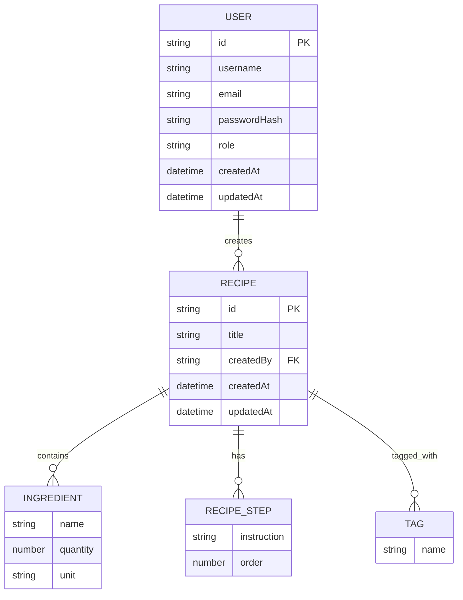

```mermaid
erDiagram
  USER ||--o{ RECIPE : creates
  RECIPE ||--o{ INGREDIENT : contains
  RECIPE ||--o{ RECIPE_STEP : has
  RECIPE ||--o{ TAG : tagged_with

  USER {
    string id PK
    string username
    string email
    string passwordHash
    string role
    datetime createdAt
    datetime updatedAt
  }

  RECIPE {
    string id PK
    string title
    string createdBy FK
    datetime createdAt
    datetime updatedAt
  }

  INGREDIENT {
    string name
    number quantity
    string unit
  }

  RECIPE_STEP {
    string instruction
    number order
  }

  TAG {
    string name
  }
```