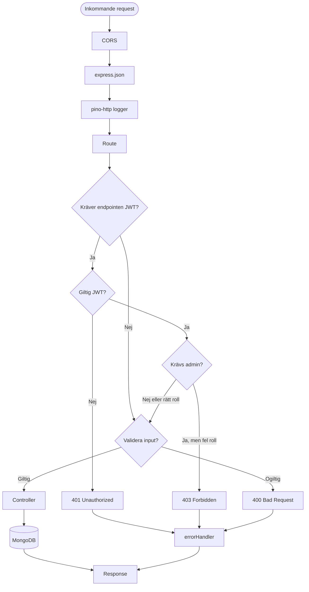

```mermaid
flowchart TD
  Start([Inkommande request]) --> Cors[CORS]
  Cors --> Json[express.json]
  Json --> Logger[pino-http logger]
  Logger --> Route[Route]
  Route --> Auth{Kräver endpointen JWT?}
  Auth -->|Nej| Validate{Validera input?}
  Auth -->|Ja| CheckJwt{Giltig JWT?}
  CheckJwt -->|Nej| Unauthorized[401 Unauthorized]
  CheckJwt -->|Ja| Role{Krävs admin?}
  Role -->|Ja, men fel roll| Forbidden[403 Forbidden]
  Role -->|Nej eller rätt roll| Validate
  Validate -->|Ogiltig| BadRequest[400 Bad Request]
  Validate -->|Giltig| Controller[Controller]
  Controller --> Database[(MongoDB)]
  Database --> Response[Response]
  Unauthorized --> ErrorHandler[errorHandler]
  Forbidden --> ErrorHandler
  BadRequest --> ErrorHandler
  ErrorHandler --> Response
```